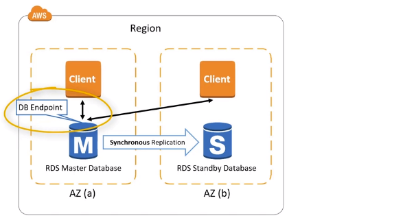
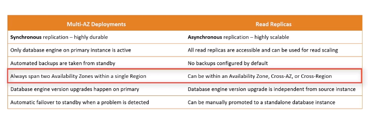

# RDS
- Managed relational databse
- Manages common administrative DB tasks e.g backups, patches, recovery, automatic failure detection. Point in-time restore.
- Achive High availabilty with a primary instance and synchronous secondary instance to fail over to when a problem occurs.
- RDS instance classes:- Burstable, standard, Memory-optimized , depending on the engine picked.
- Storage backed by EBS(gp2, io1)
- **Storage autoscaling**:- both vertical and horizontal. 
    Increase storage dynamically, avoid to manually scaling your storage. You have to set maximum storage threshold(maximum limit for DB storage)
- Useful for unpredictable workloads.

## Multi-AZ
- Multi-AZ for HA creates a standy instance in another AZ for data redunduncy, Replication is synchronous. 
- Master-Standy configuration, during updates standy instances gets promoted to primary, db endpoint gets switched between primary and standby.
- More high durability of data.
- Not for performance.
- One DNS name.
- Automatic failover incase of loss
- Not used for scaling

## RDS Read replica
- For high scalabilty, scaling up(change the DB instance to a large one), scale out(via read-replicas).
- Deploy DB instances in other AZs for performing queries.
Asynchronous replication is used to update the read replica whenever there is a change in the source DB instance.
- Allows read-only connections
- Create a read replica from another read replica, at expense of low latency.
- RDS replicates all dbs in the source DB instance.
- Provide enhances performance for read-heavy workloads
- Supports CRR:- enables you to create one or more read-only copies of the DB instance in a diffrent AWS region. at an extra cost
- Can be promoted to a standalone db instance
- Run queries against a read replica e.g Business reporting or data warehousing, where you want business reporting queries.
- Network cost when data goes from one AZ to another.
- Upto 15 read replicas

## RDS Proxy
- Allows apps to pool and share db connections established with the DB
- Improve db efficiency by reducing the stress on DB resources and minimize open connections
- Serverless, auto-scaling, HA(multi-az)
- Reduced RDS & Aurora failover time.
- Enforce IAM Authentication
- Not publicly accessible

## RPO and RTO
- Recovery Point Objective:- maximum period of data loss that is acceptable in the event of failure or incident, measured in minutes
- Recovery Time Objective:- maximum amount of downtime that is permitted to recover from backup and resume processing, measured in hours.

## DB instance storage types
### Magnetic
### General purpose
### Provisioned IOPS

## RDS Backup options
- creates a storage volume of your db instance, saves the automated backups of the db instance for the specified retention period.
- can copy manual and automatic snapshots but only share manual snapshots.
- Can create an encyrpted db from an encrypted snapshot taken from an unencrypted db, while creating the snapshot, enable encryption.
- During automated backup, Amazon RDS creates a storage volume snapshot of the entire DB instance, RDS uploads transaction logs for DB instances to Amazon S3 every 5 minutes. Retention period is 1-35days
- 

# Aurora
- Amazon Aurora is a relational database engine that combines the speed and reliability of high-end commercial databases with the simplicity and cost-effectiveness of open source databases.
- Aurora is AWS cloud optimized and 5X performance improvement over MySQL and 3X over postgres on RDS
- Can have 15 read replicas
- Aurora automated backups cannot be disabled.
- 6 copies of your data across 3 AZ
#### Features
- Automatic failover
- Backup and recovery
- isolation and security.
- Industry compliance
- Backtrack:- restore data at any point in time

## Aurora Replicas
- Aurora replicas have two main purposes:- you can issue queries to them to scale the read operations for your application, you do so by connecting the reader endpoint to the cluster, that way aurora can spread the load for read-only connections across as many Aurora replicas as you have in the cluster.
- Aurora replicas also help to increase availability, if the writer instance in a cluster becomes unavailable, Aurora automatically promotes one of the reader instance tp tak its place as a writer.

## Aurora DB cluster
- Master + 15 read replicas, auto sacling,
- reader endpoint:- for reading, load balancing at the connection level
- Writer endpoint

## Aurora serverless
- On-demand autoscaling configuration for aurora
- Decouples compute and storage tiers.
- Aurora DB cluster scales up and down based on demand, different from aurora provisioned db clusters where capacity is managed manually.
- Region specific and works with specific mySQl and PostgreSql versions
- works for unpredictable workloads.
*use cases*
1. Infrequently used applications.
2. New applications
3. Variable workloads of lightly used applications
4. Development and test DBS, can pause workloads when not in use.
### How it works
- specify Aurora capacity units(ACUS). ACU is a combinations of 2Gib mem, corresponding CPU and networking. Storage automatically scales from 10GiB to 123TiB.
- specify min and max ACU, automatically creates scaling rules for CPU utilization thresholds, connections and memory.

## Aurora global databases
- span multiple regions, low latency global reads and provides fast recovery from an outage that might affect a single region.
- Primary DB cluster in one region and sec DB in one or more regions, writes to the primary DB cluster
- Up to 5 secondary regions.
- Upto 16 read replicas in secondary region.
- have read/write capabilities move from one region to another
- gloabal reads with low latency.
- scalable secondary Aurora DB clusters
- Region specific and works with specific mySQl and PostgreSql versions

## Aurora and RDS Security
- ### At-Rest enccyrption
    - master node and replicas are encyrpted at launch using KMS
    - If master in't encyrpted, the read replicas cannot be encypted.
    - to encrypt an un-encypted db, take a snapshot, while restoring from spanshot, encyrpt
- ### In-flight encryption
    -  TLS ready by default, use AWS TLS root certs client side

# ElastiCache
- Stores critical pieces of data in-memory for low latency access.
- AWS managed service, provides automatic failure detection and recovery.
- Improves the performance of web applications by retrieving data from in-memory
- Reduces load on RDS by fetching frequently accessed data from elasticache.
- supports
    1. redis:- preferred when you need to perform data structural operation such as , Supports multi-az
    2. Memcached:- preferred when need simple key-value pair which stores content from consistent data stores, does not support multi-az capabilities, no backups and restore
*can cache results of I/O-intensive database queries or results of computational-intensive calculations*
## Elasticache security
- provides encyrption features for data in redis clusters. In-transit i.e moving from one node to another in cluster or btwn cluster and application.
- cluster must meet these specifications
    replication group must be running redis 3.2.6, 4.0.10 and must be in a vpc
## Access patterns within same vpc
- cluster SG restricts access to the app instances, create custom rules in the SG for redis cluster that allow connections from the SG for app EC2 instances
## Access patterns within diff vpc
- Can be done through VPC peering. Create a VPC peering connection between VPC in your account or with a VPC in another AWS account in the same region.
- Make sure VPCS do not have overlapping IP ranges or peering won't work.
## Access patterns within diff vpc and diff region
Create a transit VPC that serves as a global network transit.

## Elasticache session store
- While a user session is active, the application stores all session-related data in-memory or in a session store
### sticky sessions
- every request from specific user must go to the same user.
- uneven ELB traffic distribution routinely sending a disproportionate amount of traffic to one server.
### Elasticache redis
stores the session information outside the app server instances.
- use elasticache for redis as a fast key-value store.

## Lazy Loading
- 
## Write through
- Add or update cache when database is updated.

