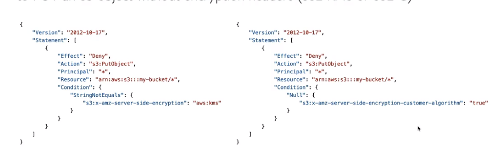

# S3
- Object-level storage, objects are stored in buckets,
- Buckets must be globally unique
- Buckets are defined at the regional level
- Naming convention:- No uppercase, no underscore, 3-63 characters long, 
- Use cases:- Backup and storage, Archive, DR, Application hosting, Media hosting, Software delivery.
- Objects have keys, Key is the full path
    e,g s3://my-bucket/my_file.txt
- Max object size is 5TB
- Uploading more than 5GB,must use "multi-part upload"
## Storage Classes
- Durability:- highly durable 11, 9's(99.999999999%), same for all storage classes
- Availability:- Varies depending on storage classes, 
1. ### Standard- General purpose
    - Used for frequently access data, low latency and high throughput
    - Use cases: content distribution, gaming
2. ### Standard-Infrequent Access
    - Lower cost than standard, data that is frequently accessed
    - S3 standard-IA: for disaster recovery, backups. Highly available
3. ### One Zone-Infrequent Access
    - S3 one zone-IA:- high durability, data is lost when AZ is destroyed, less availability
4. ### Glacier Instant Retrieval 
    - Low cost object-storage, meant for archiving. cost involves cost of storage + cost of object retrieval.
    - Millisecond retrieval, minimum storage duration is 90 days
5. ### Glacier Flexible Retrieval
    - Low cost object-storage, meant for archiving. cost involves cost of storage + cost of object retrieval.
    - **Expidited**:- 1 to 5 mins retrival time, **Standard**:-3 to 5 hours, **Bulk**:- 5 to 12 hrs.
    - Min storage duration is 90 days
6. ### Glacier Deep Retrieval
    - Low cost object-storage, meant for archiving. cost involves cost of storage + cost of object retrieval.
    - **Standard**:- 12 hours, **Bulk**:- 48hours
    - Min storage is 180 days
    - Long term storage, lowest cost
7. ### Intelligent Tiering
    - Allows you to move objects between access tiers based on usage
    - Monthly monitoring and auto-tiering fee.
    - **Frequent Access Tier**:- default tier, **Infrequent Access Tier**:- Automatic, objects not accesed in 30 days, **Archive  Instant Acess Tier**:- Automatic, objects not accesed in 90 days, **Achive access Tier**:- optional, from 90-700+ days, **Deep Archive**:- optional, from 180-700+ days
## Bucket Policy
- 
- **User-Based**
    - IAM policies:- which API calls should be allowed for a specific user from IAM
- **Resource-based**
    - Bucket policies:- bkt wide rules from s3 console
    - Object ACL:- finer grain
    - Bucket ACl:- access to bkt
- **NOTE** IAM principal can access an s3 object if
    - The user IAM permissions allow, OR resource policy Allow and there's no explicit DENY

### Amazon s3 CRR(Cross-Region Replication) and SRR(Same-Region Replication)
- Versioning must be enabled for both source and destination bkts
- AWS account can be different
- Copying is async
- Might give proper IAM persmissions for s3
- After enabling replication, only new objects are replicated, for older objects, replicate using s3 batch replication
- 

### Lifecycle Rules
- Rules can be created for specific buckets
- **Transition Action**:- configure objects to transition to another storage class. e.g move to deep glacier after certain time.
- **Expiration Action**:- configure objects to expire after some time.
    e.g delete incomplete multipart upoads, Old versions of files, access logs delete after said days.

### Amazon s3 Analytics
- Helps decide when to transition objects to right storage class.Works for Standard and Standard-IA
- Takes 24-48 hrs to see reports

### S3 Requestor pays
- Requestor pays instead of owner for the networking cost of the download
- Helpful while sharing large data sets.

### S3 event notifications
- Use cases:- react to events on S3, e.g generate thumbnails from images uploaded.
- EventBridge:- offers, Advanced filtering, multiple destinations, 
- Send notifications to SQS, SNS, Lambda.
- We attach an IAM policy on SQS, SNS, Lambda allowing the s3 to perform the action.
- S3 & EventBridge:- send to multiple destinations, allows for advanced filtering

#### S3 performance
- S3 scales to high request rates, 
- **Multipart upload**:- recommended for files > 100mb, must use for files > 5GB
    parallelize uploads
- **S3 transfer acceleration**:- Increase transfer speed by transferring file to an AWS edge location, which will forward data to s3 bkt in the target region. 
- **S3 byte-range fetches**:- parallize gets, by requesting specific byte ranges, speed up download,
- retrieve only partial data.

#### S3 Select & Glacier Select
- Retrieve less data using SQL by performing server-side filtering.
- can filter by rows, columns
- Less network transfer, less CPU cost client-side

#### S3 Batch Operations
- Perform bulk operations on existing S3 objects with a single request e.g
    - Modify object metadata & properties.
    - Encrypt un-encyrpted objects
    - Modify ACLs, tags
    - Restore objects from S3 glacier
    - Copy objects between S3 buckets.
    - Invoke Lambda functions
- Manages retries, tracks progress, sends completion notifications ....
- Use S3 inventory to get object list and use S3 select to filter objects

## S3 Encyription
1. **Server-Side Encryption(SSE)**
    - *SSE-S3(server-side encryption with amazon s3-managed keys)*:- 
            - Fully managed by AWS, Encyrption type is AES 256
            - Enabled by default
            - You can force encryption by using a bucket policy and refuse any API call to put an S3 object without encryption headers 
    - *SSE-KMS(server-side encryption with KMS keys stored in KMS)*:- 
            - User control + audit key usage using cloudtrail.
            - must set header "x-amz-server-side-encryption": "aws:kms"
            - may count towards the KMS quota per second.
    - *SSE-C(server-side encryption with Customer provided keys)*:-
            - S3 does not store the encryption key you provide
2. **Client-side Encryption**:- Customer fully manages the keys and encryption
- Encryption in transit
    - Also SSL/TLS.

### CORS
- When enabled, Allows client to make a cross-origin request on the s3 bucket [Cors JSON example](https://docs.aws.amazon.com/AmazonS3/latest/userguide/ManageCorsUsing.html)

#### MFA delete
- force users to generate a code on a device before doing important operations on S3, protect against accidental deletion.
- Versioning must be enabled
- Only Bucket owner(root account) can enable/disable MFA delete. `aws s3api put-bucket-versioning --bucket DOC-EXAMPLE-BUCKET1 --versioning-configuration Status=Enabled,MFADelete=Enabled --mfa "SERIAL auth-code" `

#### S3 Access Logs
- For audit purpose, you may want to log all access to S3 buckets, Any request to any account, authorized or denied will be logged into another s3 bucket.
- Data can be analyzed using data analysis tools e.g Athena.
- Target Logging bkt must be in the same AWS region.

#### Pre-signed URL
- Users given a pre-signed URL inherit the permissions of the user that generated the URL
- All objects and buckets by default are private. The presigned URLs are useful if you want your user/customer to be able to upload a specific object to your bucket, but you don't require them to have AWS security credentials or permissions.

- When you create a presigned URL, you must provide your security credentials and then specify a bucket name, an object key, an HTTP method (PUT for uploading objects), and an expiration date and time. The presigned URLs are valid only for the specified duration. 
- That is, you must start the action before the expiration date and time. If the action consists of multiple steps, such as a multipart upload, all steps must be started before the expiration, otherwise you will receive an error when Amazon S3 attempts to start a step with an expired URL.
- In your bucket, click on cloudshell,
to make a pre-sign url `aws s3 presign [S3 URI] --expires-in 60`

#### S3 glacier Vault lock
- Adopt a write once read many(WORM) model at bkt-level.
- Lock the policy from future edits.
- Helpful for compliance and data retention.
- **Object Lock**:- Worm at the object level.
    1. Retention mode - Compliance:- Object versions cannot be deleted by any user, even root.
    2. Retention mode - Governance:- Some users have special permissions to change the retention or delete the object.
    3. Retention Period:- protect the object for a fixed period, can be extended.
    4. Legal Hold:- protect the object indefinitely, independent from retention period.

#### S3 Access points
- Using prefixes on the bucket policy, to grant read or write access    
- Has an access point policy, Own DNS name
- Can define an access point within the VPC, 
- Must Create a VPC endpoint to access the access point(Gateway or interface endpoint)

#### S3 Object Lambda
- Use Lambda functions to change the object before it is retrieved by a user.
- One S3 bkt is needed, on top of which we create S3 Access point and S3 Object Lambda Access points.
- Use Cases: Converting data formats, removing PII.

## notes
- With Amazon S3, you can store as much data as you want and access it when needed. 
- S3 supports and unlimited number of files in a bucket so it is not necessary to know your storage needs up front or try to estimate. 
- S3 can be scaled quickly and appropriately to meet the storage demands of your environment. 
- S3 asynchronously replicates information to all availability zones within a region. Amazon S3 scales to support very high request rates. If your request rate grows steadily, Amazon S3 automatically partitions your buckets as needed to support higher request rates.

## s3 pre-sign url
- 